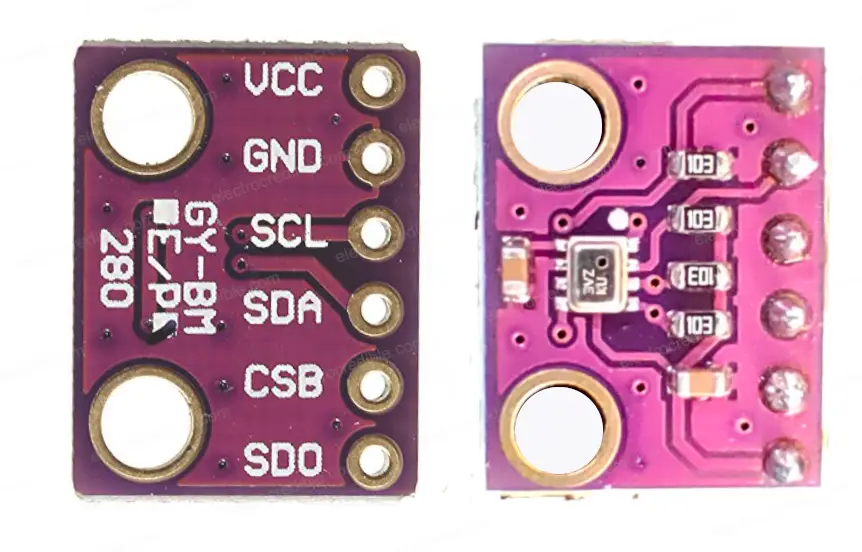

# BMP280 - Pressure and temperature sensor
Micropython wrapper around BMP280 (HW-611 E/P 280) sensor library for Raspberry Pico using I2C with RTC and optional logger.

## Hardware

-   [Raspberry Pico](https://www.raspberrypi.com/products/raspberry-pi-pico/)
-   [BMP280 sensor](https://www.bosch-sensortec.com/media/boschsensortec/downloads/datasheets/bst-bmp280-ds001.pdf)  
    

## Software

-   [MicroPython](https://micropython.org/download/RPI_PICO/) - Pico firmware (RP2 port)
-   [pico-bmp280](https://github.com/flrrth/pico-bmp280) - sensor library

## Installation
1. Configure pins in `config/board.py` file.
1. Adjust the `main.py` and `boot.py` files to your needs.
1. Copy all *.py files to the root of your Pico filesystem. Retain the directory structure.

## Sensor Functional description

### Measurement flow

1. Measure temperature
2. Measure pressure
3. Apply IIR filter (optional)
4. Save results in registers (can be read regardles of measurements)

### Power mode

-   Sleep mode - no measurements performed
-   Normal mode - automated, perpetual cycling between measurement and standby periods; fast readout
-   Forced mode - single measurement then sleep mode; slow readout

Default: Forced mode

For low frequency measurements use forced mode.  
For continuous measurements use normal mode.

### Pressure measurement

Can be disabled or oversampled up to 16x for reduced noise and better resolution.  
Oversampling increases power consumption and measurement time.  
Default: 1x

### Temperature measurment

Can be disabled or oversampled up to 16x for reduced noise and better resolution.  
Oversampling increases power consumption and measurement time.  
Oversampling temperature makes little difference.  
Default: 1x

### IIR filter

To suppress short-term changes IIR filter can be enabled with coefficient up to 16x.  
Default: 0x

### Standby time

Determines how often automated measurements are made in normal mode.  
Has no effect in forced mode.  
Default: 1000 ms

## Pinout

| Pin Name | Description         |
| -------- | ------------------- |
| VCC      | Power supply (3.3V) |
| GND      | Ground              |
| SCL      | Serial clock        |
| SDA      | Serial data input   |
| CSB      | Chip select         |
| SDO      | Serial data output  |

## Interfaces

-   SPI - Connect sensor's SCL, SDA, SDO and CSB pins to correct SPI GPIO pins on the Pico.
-   I2C - Connect sensor's SCL and SDA pins to correct I2C GPIO pins on the Pico. CSB and SDO pins are not used.

## Code examples

For working example see [main.py](main.py) and [boot.py](boot.py) files.

```py
# Chip configuration for BMP280Sensor class
chip_config = BMP280Configuration()
chip_config.power_mode = BMP280Configuration.POWER_MODE_NORMAL
chip_config.pressure_oversampling = BMP280Configuration.PRESSURE_OVERSAMPLING_16X
chip_config.temperature_oversampling = BMP280Configuration.TEMPERATURE_OVERSAMPLING_2X
chip_config.filter_coefficient = BMP280Configuration.FILTER_COEFFICIENT_OFF
chip_config.standby_time = BMP280Configuration.STANDBY_TIME__5_MS
```
